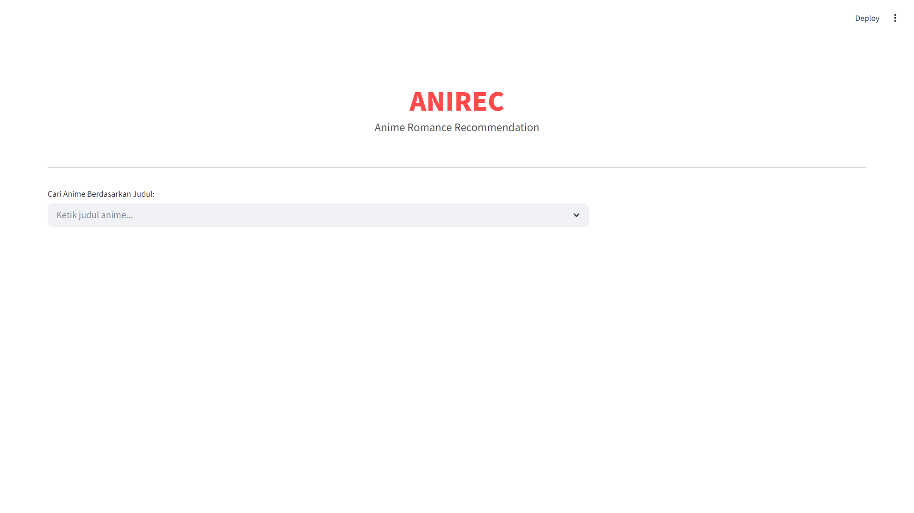
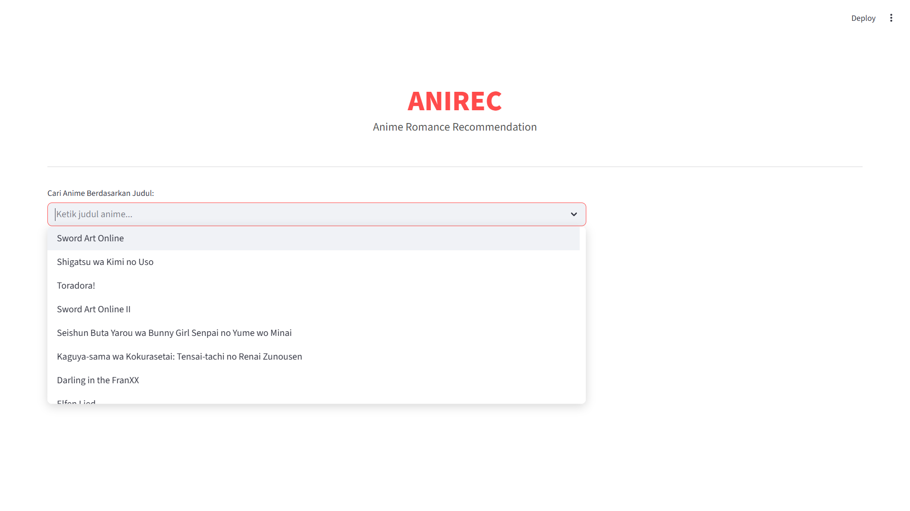
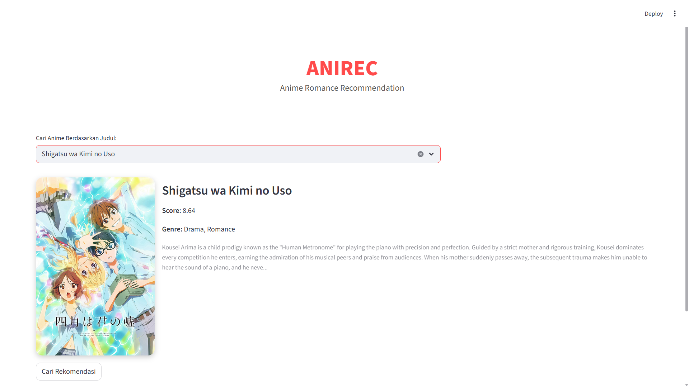
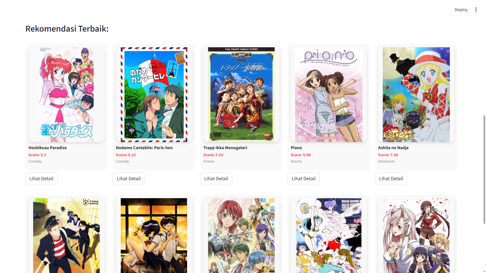
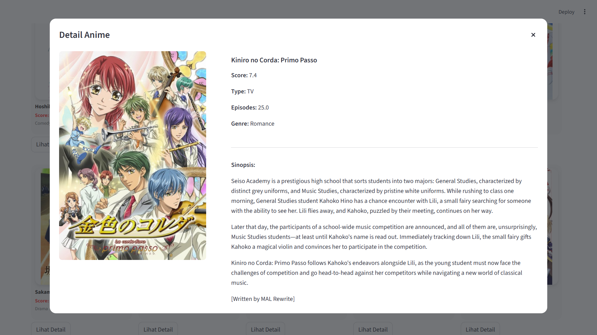

# Anirec

## Apa itu Anirec

Anirec merupakan proyek sistem rekomendasi berbasis web yang saya rancang khusus untuk penggemar anime, khususnya genre Romance. Dalam proyek ini, saya menerapkan pendekatan Machine Learning dengan metode Content-Based Filtering untuk menganalisis kemiripan antara satu judul anime dengan judul lainnya. Saya membangun sistem ini untuk membantu pengguna menemukan tontonan baru yang memiliki karakteristik cerita, nuansa, dan elemen plot yang serupa dengan anime favorit mereka.

---

## Tujuan Pengembangan

Saya mengembangkan proyek ini untuk menjawab tantangan "choice paralysis" yang sering dialami penggemar anime akibat banyaknya judul yang tersedia. Tujuan utama saya adalah menyediakan alat pencarian yang cerdas dan personal. Selain itu, proyek ini saya jadikan sebagai sarana untuk mengasah kemampuan teknis dalam pengolahan data *end-to-end*, mulai dari ekstraksi data via API, pengolahan Natural Language Processing (NLP), hingga pengembangan antarmuka pengguna interaktif menggunakan framework Streamlit.

---

## Metodologi dan Teknis

Dalam pengembangan teknisnya, saya menerapkan alur kerja dan metode sebagai berikut:

1.  **Akuisisi Data (Data Acquisition)**
    Alih-alih menggunakan dataset statis, saya membangun pipeline pengumpulan data mandiri menggunakan Python. Saya mengembangkan skrip (`ambil_data.py`) yang terhubung dengan **Jikan API** (Unofficial MyAnimeList API). Skrip ini secara otomatis menarik ribuan data anime, menangani batasan permintaan (*rate limiting*), dan memfilter khusus genre Romance untuk memastikan data yang digunakan adalah data aktual dan relevan.

2.  **Ekstraksi Fitur (Feature Extraction)**
    Saya memanfaatkan teknik **TF-IDF (Term Frequency-Inverse Document Frequency)** Vectorizer. Metode ini saya gunakan untuk mengubah teks sinopsis dan genre yang telah dibersihkan menjadi vektor numerik agar mesin dapat memahami konteks dan kata kunci penting yang merepresentasikan setiap anime.

3.  **Pengukuran Kemiripan (Similarity Metric)**
    Saya menggunakan **Cosine Similarity** untuk menghitung jarak sudut antara vektor anime. Algoritma ini memungkinkan sistem untuk mengukur seberapa dekat kemiripan dua anime secara matematis berdasarkan plot cerita dan genrenya.

4.  **Logika Filtrasi (Anti-Duplikat)**
    Di sisi aplikasi, saya menanamkan algoritma penyaringan khusus. Algoritma ini saya buat untuk mencegah munculnya rekomendasi yang berasal dari waralaba (franchise) yang sama (misalnya season 2 atau OVA dari judul yang sama), sehingga daftar rekomendasi yang saya sajikan kepada pengguna menjadi lebih variatif.

---

## Fitur Utama

Adapun fitur dan komponen utama yang saya implementasikan dalam aplikasi ini adalah:

1.  **Pencarian Judul**
    Fitur yang memudahkan pengguna memilih judul anime dari database menggunakan mekanisme pilih atau ketik yang saya sediakan.

2.  **Pratinjau Informasi**
    Sebelum memberikan rekomendasi, sistem akan menampilkan informasi detail mengenai anime yang dipilih pengguna, termasuk poster, skor, dan cuplikan sinopsis untuk memastikan validasi input.

3.  **Rekomendasi Cerdas**
    Sistem akan menampilkan 10 rekomendasi anime teratas yang paling relevan berdasarkan kalkulasi model yang telah saya latih.

4.  **Detail Mendalam**
    Setiap poster anime saya lengkapi dengan tombol interaktif yang memunculkan jendela *pop-up*, berisi informasi lengkap dan sinopsis penuh dari anime terkait.

---

## Dokumentasi Penggunaan

Berikut adalah panduan visual penggunaan aplikasi Anirec yang telah saya siapkan:

**1. Halaman Utama**
Tampilan awal web saat pertama kali dibuka.

**2. Proses Pencarian**
Tampilan saat pengguna hendak mencari judul anime.

**3. Pratinjau Anime Terpilih**
Tampilan validasi yang muncul setelah pengguna memilih judul.

**4. Hasil Rekomendasi**
Tampilan daftar anime yang direkomendasikan sistem setelah tombol proses ditekan.

**5. Detail Anime Rekomendasi**
Tampilan detail (pop-up) ketika pengguna menekan tombol "Lihat Detail".

---

## Akses Web

Saat ini aplikasi masih saya jalankan dalam lingkungan pengembangan lokal (*localhost*). Saya akan menyertakan tautan akses di bawah ini setelah aplikasi berhasil diunggah ke server produksi.

[Tautan Aplikasi Akan Segera Tersedia]

---

## Pengembang

Gerald Jepedro Sitorus
[@g3raldatsc](https://github.com/g3raldatsc)

---

## Tags

`Python` `Streamlit` `Jikan API` `Anime` `Romance` `Data Analyst` `Data Scientist` `Data Science`

 

  

